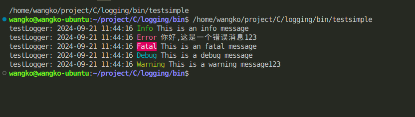
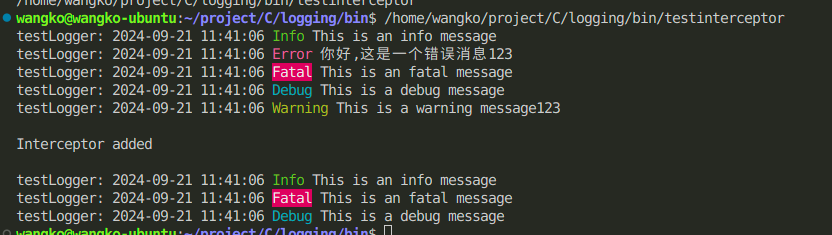

# C language logging library logging

## brief

Logging is a lightweight and easy-to-use C language log library that supports log level, log format, log output, log files, and other functions.

## function
- Support log levels: DEBUG, INFO, Warning, ERROR, FATAL
- Support log formats: timestamp, log level, log content
- Support log output: console, file
- Support log files: automatic creation, automatic scrolling, log segmentation

## install
- Conan
```shell
conan create .
```
- cmake
```shell
git clone https://github.com/WangZhongDian/logging.git
cd logging
cmake build -B build . && cd build && cmake --build .
cmake --install .
```

## usage



### console log 
```c
#include "logging.h"

int main() {
    Log_info("This is an info message");
    Log_error("This is an error message%s", "123");
    Log_fatal("This is an fatal message");
    Log_debug("This is a debug message");
    Log_warning("This is a warning message%s", "123");

    destroyDefaultLogger();
    return 0;
}
```

### file log
```c
#include "logging.h"
#include "logging/logging-handler.h"

int main() {
    log_Handler *hander = loggingHandlerFile("test_log", 1024 * 1024 * 10);
    addHandler(getDefaultLogger(), hander);

    Log_info("This is an info message");
    Log_error("This is an error message%s", "123");
    Log_fatal("This is an fatal message");
    Log_debug("This is a debug message");
    Log_warning("This is a warning message%s", "123");

    destroyDefaultLogger();
    return 0;
}
```

### Logging filter 
> Support adding custom filters, currently with built-in substring filters
> The function of an filter is to redirect filtered logs to the filter's dedicated processor

#### Multiple substring filters
```c
#include "logging.h"
#include "logging/logging-core.h"
#include "logging/logging-filter.h"
#include <stdbool.h>
#include <stdio.h>
#include <time.h>

int main() {
    Log_info("This is an info message");
    Log_error("This is an error message%s", "123");
    Log_fatal("This is an fatal message");
    Log_debug("This is a debug message");
    Log_warning("This is a warning message%s", "123");

    char *test1[] = {"This", NULL};

    log_filter *tint =
        loggingFilterSubStr(test1,
                            LOG_DEBUG,
                            loggingHandlerFile("test_interceptor", 1024 * 1024),
                            false);

    addFilter(getDefaultLogger(), tint);

    char *test2[]     = {"123", NULL};

    log_filter *tint1 = loggingFilterSubStr(
        test2,
        LOG_ERROR,
        loggingHandlerFile("test_interceptor1", 1024 * 1024),
        true);

    addFilter(getDefaultLogger(), tint1);

    printf("\n");
    printf("filter added\n");
    printf("\n");

    Log_info("This is an info message");
    Log_error("This is an error message%s", "123");
    Log_fatal("This is an fatal message");
    Log_debug("This is a debug message");
    Log_warning("This is a warning message%s", "123");

    destroyDefaultLogger();
    return 0;
}
```

