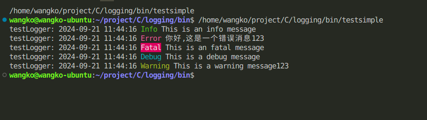

# C language logging library logging

## brief

Logging is a lightweight and easy-to-use C language log library that supports log level, log format, log output, log files, and other functions.

## function
- Support log levels: DEBUG, INFO, Warning, ERROR, FATAL
- Support log formats: timestamp, log level, log content
- Support log output: console, file
- Support log files: automatic creation, automatic scrolling, log segmentation

## install
- Conan
```shell
conan create .
```
- cmake
```shell
git clone https://github.com/WangZhongDian/logging.git
cd logging
cmake build -B build . && cd build && cmake --build .
cmake --install .
```

## usage



### console log 
```c
#include "logging.h"

int main() {
    Logger *logger = newDefaultLogger("testLogger", LOG_DEBUG);

    log_info("This is an info message");
    log_error("This is an error message%s", "123");
    log_fatal("This is an fatal message");
    log_debug("This is a debug message");
    log_warning("This is a warning message%s", "123");

    destroyDefaultLogger();
    return 0;
}
```

### file log
```c
#include "logging.h"
#include "logging/logging-handler.h"

int main() {
    Logger *logger = newDefaultLogger("testLogger", LOG_DEBUG);
    logger->addHandler(loggingHandlerFile("test1", 1024*1024));

    log_info("This is an info message");
    log_error("This is an error message%s", "123");
    log_fatal("This is an fatal message");
    log_debug("This is a debug message");
    log_warning("This is a warning message%s", "123");

    destroyDefaultLogger();
    return 0;
}
```

### Logging filter 
> Support adding custom filters, currently with built-in substring filters
> The function of an filter is to redirect filtered logs to the filter's dedicated processor


#### example
Redirects filtered logs to a dedicated file processor
```c
#include "logging.h"
#include <stdio.h>

int main() {
    Logger  *logger = newDefaultLogger("testLogger", LOG_DEBUG);

    log_info("This is an info message");
    log_error("This is an error message%s", "123");
    log_fatal("This is an fatal message");
    log_debug("This is a debug message");
    log_warning("This is a warning message%s", "123");

    char *test1[]         = {"123", "tt", NULL};

    log_filter *tint = loggingFilterSubStr(
        test1,
        LOG_DEBUG,
        loggingHandlerFile("test_interceptor", 1024 * 1024),
        true);

    logger->addFilter(tint);

    printf("\n");
    printf("filter added\n");
    printf("\n");

    log_info("This is an info message");
    log_error("This is an error message%s", "123");
    log_fatal("This is an fatal message");
    log_debug("This is a debug message");
    log_warning("This is a warning message%s", "123");

    destroyDefaultLogger();
    return 0;
}
```

#### Multiple substring filters
```c
#include "logging.h"
#include <stdbool.h>
#include <stdio.h>
#include <time.h>

int main() {
    Logger *logger = newDefaultLogger("testLogger", LOG_DEBUG);

    log_info("This is an info message");
    log_error("This is an error message%s", "123");
    log_fatal("This is an fatal message");
    log_debug("This is a debug message");
    log_warning("This is a warning message%s", "123");

    char *test1[]         = {"This",NULL};

    log_filter *tint = loggingFilterSubStr(
        test1,
        LOG_DEBUG,
        loggingHandlerFile("test_interceptor", 1024 * 1024),
        false);

    logger->addFilter(tint);

    char *test2[]         = {"123",NULL};

    log_filter *tint1 = loggingFilterSubStr(
        test2,
        LOG_DEBUG,
        loggingHandlerFile("test_interceptor1", 1024 * 1024),
        true);

    logger->addFilter(tint1);

    printf("\n");
    printf("filter added\n");
    printf("\n");

    log_info("This is an info message");
    log_error("This is an error message%s", "123");
    log_fatal("This is an fatal message");
    log_debug("This is a debug message");
    log_warning("This is a warning message%s", "123");

    destroyDefaultLogger();
    return 0;
}
```

