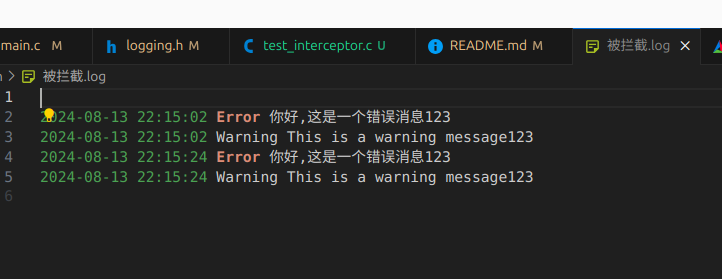

# C语言日志库logging

## 简介

logging是一个轻量级的简单易用C语言日志库，支持日志级别、日志格式、日志输出、日志文件等功能。

## 功能

- 支持日志级别：DEBUG、INFO、WARN、ERROR、FATAL
- 支持日志格式：时间戳、日志级别、日志内容
- 支持日志输出：控制台、文件
- 支持日志文件：自动创建、自动滚动、自动删除(未完成)

## 使用方法

### 控制台日志
```c
#include "logging.h"

int main() {
    Logging *log = createLogging(); // 创建日志对象

    Logger *logger = log->getLogger("testLogger",LOG_DEBUG); //获取日志控制器

    logger->addHandler(consoleHandler("test")); //为日志对象添加控制台处理器

    logger->info("This is an info message");
    logger->error("你好,这是一个错误消息%s", "123");
    logger->fatal("This is an fatal message");
    logger->debug("This is a debug message");
    logger->warning("This is a warning message%s", "123");

    destroyLogging(log);
    return 0;
}
```

### 文件日志
```c
#include "logging.h"

int main() {
    // Your code goes here
    Logging *log = createLogging();
    Logger *logger = log->getLogger("testLogger",LOG_DEBUG);
    
    logger->addHandler(consoleHandler("test"));   //为日志对象添加文件处理器

    logger->info("This is an info message");
    logger->error("你好,这是一个错误消息%s", "123");
    logger->fatal("This is an fatal message");
    logger->debug("This is a debug message");
    logger->warning("This is a warning message%s", "123");

    destroyLogging(log);
    return 0;
}
```

### 日志拦截器
> 支持添加自定义的拦截器， 目前内置了子串拦截器

> 拦截器的作用:可以将拦截到的日志重定向到拦截器的专属处理器中


#### 例子
将拦截到的日志重定向到专属文件处理器中
```c
#include "logging.h"


int main() {
    Logging *log = createLogging();
    Logger *logger = log->getLogger("testLogger",LOG_DEBUG);
    logger->addHandler(consoleHandler("test"));

    logger->info("This is an info message");
    logger->error("你好,这是一个错误消息%s", "123");
    logger->fatal("This is an fatal message");
    logger->debug("This is a debug message");
    logger->warning("This is a warning message%s", "123");

    char *test1[] = {"123", "你好"};//要拦截的字符串
    //添加拦截器，将拦截到的日志重定向到拦截器的专属处理器中
    log_Interceptor * tint = substringInterceptor(test1,2,LOG_DEBUG,fileHandler("被拦截")); 
    logger->addInterceptor(tint);
    printf("Interceptor added\n");

    logger->info("This is an info message");
    logger->error("你好,这是一个错误消息%s", "123");
    logger->fatal("This is an fatal message");

    logger->debug("This is a debug message");
    logger->warning("This is a warning message%s", "123");

    destroyLogging(log);
    return 0;
}
```
.png)

