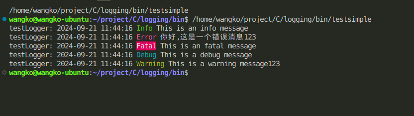
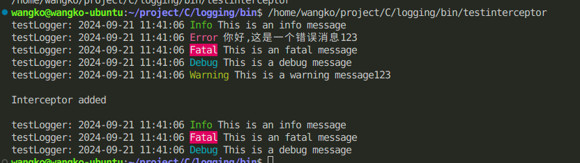

# C语言日志库logging

[English](README.en.md)

## 简介

logging是一个轻量级的简单易用C语言日志库，支持日志级别、日志格式、日志输出、日志文件等功能。

## 功能

- 支持日志级别：DEBUG、INFO、WARN、ERROR、FATAL
- 支持日志格式：时间戳、日志级别、日志内容
- 支持日志输出：控制台、文件
- 支持日志文件：自动创建、自动滚动、日志分割

## 安装
### conan安装使用
```shell
git clone https://github.com/WangZhongDian/logging.git
cd logging
conan create . 
```
在你的项目的conanfile.txt中添加
```txt
[requires]
logging/0.5.0
```

```shell
conan install . --build=missing
```

### cmake安装使用
```shell
git clone https://github.com/WangZhongDian/logging.git
cd logging
cmake build -B build . && cd build && cmake --build .
cmake --install .
```

## 使用方法



### 控制台日志
```c
#include "logging.h"

int main() {
    Logger *logger = newDefaultLogger("testLogger", LOG_DEBUG);

    Log_info("This is an info message");
    Log_error("This is an error message%s", "123");
    Log_fatal("This is an fatal message");
    Log_debug("This is a debug message");
    Log_warning("This is a warning message%s", "123");

    destroyDefaultLogger();
    return 0;
}
```

### 文件日志
```c
#include "logging.h"
#include "logging/logging-handler.h"

int main() {
    Logger *logger = newDefaultLogger("testLogger", LOG_DEBUG);
    logger->addHandler(loggingHandlerFile("test1", 1024*1024));

    Log_info("This is an info message");
    Log_error("This is an error message%s", "123");
    Log_fatal("This is an fatal message");
    Log_debug("This is a debug message");
    Log_warning("This is a warning message%s", "123");

    destroyDefaultLogger();
    return 0;
}
```

### 日志过滤器
> 支持添加自定义的过滤器， 目前内置了子串过滤器

> 过滤器的作用:可以将过滤到的日志重定向到过滤器的专属处理器中


#### 单个子串过滤器
将过滤到的日志重定向到专属处理器中
```c
#include "logging.h"
#include <stdio.h>

int main() {
    Logger  *logger = newDefaultLogger("testLogger", LOG_DEBUG);

    Log_info("This is an info message");
    Log_error("This is an error message%s", "123");
    Log_fatal("This is an fatal message");
    Log_debug("This is a debug message");
    Log_warning("This is a warning message%s", "123");

    char *test1[]         = {"123", "tt", NULL};

    log_filter *tint = loggingFilterSubStr(
        test1,
        LOG_DEBUG,
        loggingHandlerFile("test_interceptor", 1024 * 1024),
        true);

    logger->addFilter(tint);

    printf("\n");
    printf("filter added\n");
    printf("\n");

    Log_info("This is an info message");
    Log_error("This is an error message%s", "123");
    Log_fatal("This is an fatal message");
    Log_debug("This is a debug message");
    Log_warning("This is a warning message%s", "123");

    destroyDefaultLogger();
    return 0;
}
```

#### 多个子串过滤器
```c
#include "logging.h"
#include <stdbool.h>
#include <stdio.h>
#include <time.h>

int main() {
    Logger *logger = newDefaultLogger("testLogger", LOG_DEBUG);

    Log_info("This is an info message");
    Log_error("This is an error message%s", "123");
    Log_fatal("This is an fatal message");
    Log_debug("This is a debug message");
    Log_warning("This is a warning message%s", "123");

    char *test1[]         = {"This",NULL};

    log_filter *tint = loggingFilterSubStr(
        test1,
        LOG_DEBUG,
        loggingHandlerFile("test_interceptor", 1024 * 1024),
        false);

    logger->addFilter(tint);

    char *test2[]         = {"123",NULL};

    log_filter *tint1 = loggingFilterSubStr(
        test2,
        LOG_DEBUG,
        loggingHandlerFile("test_interceptor1", 1024 * 1024),
        true);

    logger->addFilter(tint1);

    printf("\n");
    printf("filter added\n");
    printf("\n");

    Log_info("This is an info message");
    Log_error("This is an error message%s", "123");
    Log_fatal("This is an fatal message");
    Log_debug("This is a debug message");
    Log_warning("This is a warning message%s", "123");

    destroyDefaultLogger();
    return 0;
}
```

